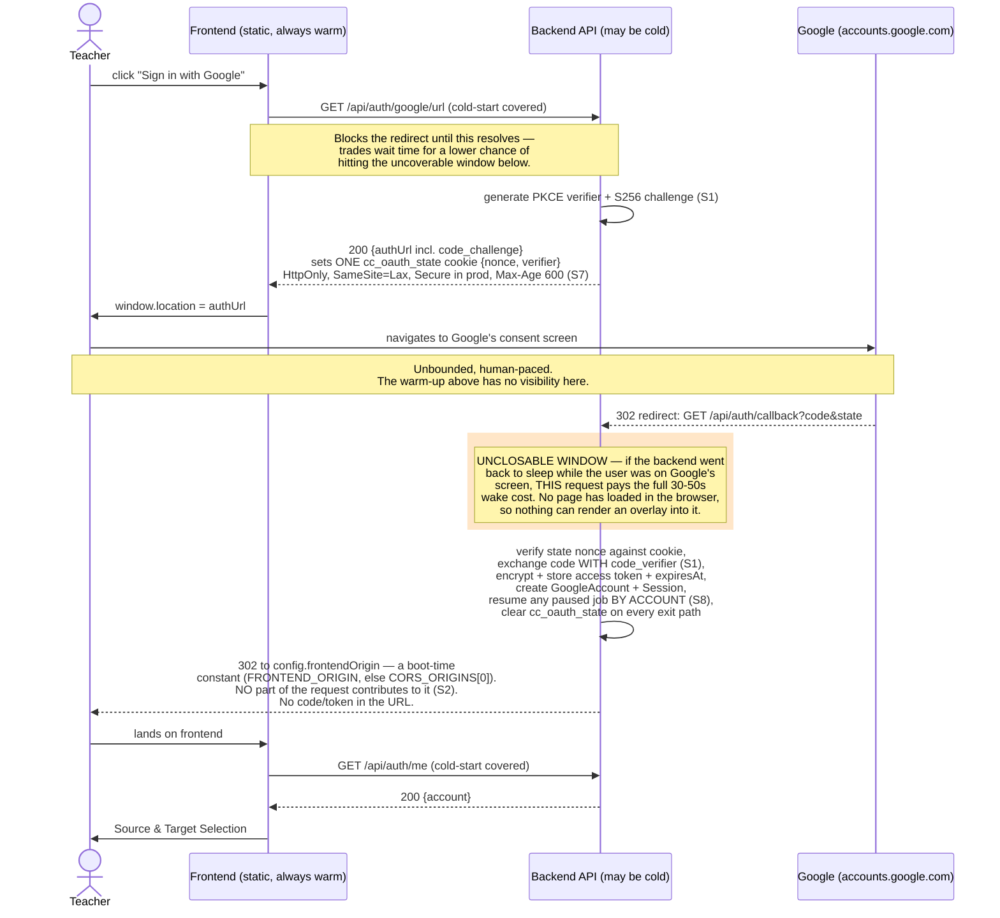

# Diagram — OAuth sign-in with the cold-start window (Decision E)

> Referenced from `../04-architecture.md` §4.1, with the security controls
> from **§8.0**. Shows the full real-OAuth sign-in sequence and marks the one
> segment that is architecturally unclosable by any client-side mechanism.

**Mitigations in place** (both already covered by the diagram above):
warm-up before the redirect, and routing the callback's *redirect target*
through the frontend so the confirmation step is cold-start-covered too.
**Not mitigated:** the shaded window — the callback route's own processing
time. See `04-architecture.md` §4.1 and Delta P0-A for the full reasoning
and the honest statement of residual risk.

**Security controls on this flow** (`04-architecture.md` §8.0): **S1** PKCE
`S256` on the code exchange — `state` alone defends the redirect leg against
CSRF but not the code against interception; **S2** the 302 target is a fixed
config value, never derived from `Referer`, `Origin`, a `returnTo`
parameter, or the `state` payload — the open-redirect this diagram's earlier
"redirect to frontend origin" left unspecified; **S7** the cookie's flags and
its 600-second lifetime; **S8** resume is resolved by session account, never
by a job id from the request.
