# Component diagram — Classroom Copier (architecture theme 3)

Static structure: modular monolith, ports-and-adapters at the Google-integration
boundary. Solid arrows = runtime dependency; dashed arrows = type-only
(interface) dependency.

```mermaid
flowchart TB
    subgraph Shared["Shared (both tiers, type-only)"]
        SharedContracts["shared-contracts<br/>(zod schemas + inferred types —<br/>every cross-tier DTO, D17)"]
    end

    subgraph Client["Web frontend (React/Vite, static site)"]
        AppShell["app-shell<br/>(wizard routing/layout)"]
        UISignIn["ui-sign-in-account-picker"]
        UISelect["ui-selection"]
        UIPreflight["ui-preflight-actionsheet"]
        UITransfer["ui-transfer-progress"]
        UISummary["ui-completion-summary"]
        UIShared["ui-shared-components<br/>(cold-start overlay, narration banner,<br/>step indicator, design tokens)"]
        ApiClient["frontend-api-client<br/>(fetch wrapper, poll loop,<br/>cold-start 2s/60s timer)"]

        AppShell --> UISignIn & UISelect & UIPreflight & UITransfer & UISummary
        UISignIn & UISelect & UIPreflight & UITransfer & UISummary --> ApiClient
        UISignIn & UISelect & UIPreflight & UITransfer & UISummary -.-> UIShared
    end

    ApiClient -.-> SharedContracts

    subgraph Server["API backend (Node/Express, persistent web service)"]
        CompRoot["composition-root<br/>(app.ts — wires provider,<br/>mounts routes/middleware)"]
        JobReconciler["job-reconciler<br/>(stale-heartbeat reconciliation,<br/>boot + interval)"]
        AuthModule["auth-module<br/>(mock sign-in, session, JWT)"]
        CoursesApi["courses-api<br/>(list courses, run preflight)"]
        TransferJobApi["transfer-job-api<br/>(create job, poll status,<br/>active-job lookup, items log)"]
        PreflightEngine["preflight-engine"]
        TransferEngine["transfer-engine<br/>(topic map, per-type post build,<br/>backoff, fallback, reconciliation)"]
        PostEnumerator["post-enumerator<br/>(single 'all posts' merge,<br/>pagination loop, total ordering key)"]
        QualityBudgets["quality-budgets<br/>(test/quality/*, test:perf,<br/>project-profile.md rows)"]
        Monetization["monetization-middleware<br/>(feature-flagged no-op)"]
        ColdStartHealth["cold-start-health<br/>(/api/health)"]
        ProviderIface["classroom-provider-interface<br/>(pure types — no runtime code)"]
        MockProvider["mock-classroom-provider<br/>(SQLite-backed simulation)"]

        CompRoot --> AuthModule & CoursesApi & TransferJobApi & Monetization & ColdStartHealth
        CompRoot --> MockProvider
        CompRoot --> JobReconciler
        CoursesApi --> AuthModule
        CoursesApi --> PreflightEngine
        TransferJobApi --> TransferEngine
        TransferJobApi --> AuthModule
        PreflightEngine --> PostEnumerator
        TransferEngine --> PostEnumerator
        QualityBudgets --> TransferEngine
        QualityBudgets --> CompRoot
        PreflightEngine -.-> ProviderIface
        TransferEngine -.-> ProviderIface
        CoursesApi -.-> ProviderIface
        MockProvider -.-> ProviderIface
        PostEnumerator -.-> ProviderIface
    end

    CoursesApi -.-> SharedContracts
    TransferJobApi -.-> SharedContracts
    AuthModule -.-> SharedContracts

    subgraph Data["Persistence"]
        DataModel[("data-model<br/>SQLite via Prisma<br/>(mock-world + app-state tables)")]
        FixtureSeed["fixture-seed-data<br/>(F1–F13 seed script)"]
    end

    ApiClient -->|HTTPS| AuthModule
    ApiClient -->|HTTPS| CoursesApi
    ApiClient -->|HTTPS| TransferJobApi
    ApiClient -->|HTTPS| ColdStartHealth

    AuthModule --> DataModel
    TransferEngine --> DataModel
    Monetization --> DataModel
    MockProvider --> DataModel
    FixtureSeed --> DataModel

    subgraph Future["Future (v2, out of boundary)"]
        RealProvider["real-classroom-provider<br/>(live Google Classroom + Drive APIs)"]
    end
    RealProvider -.->|implements, not built in v1| ProviderIface
```

## Notes
- `classroom-provider-interface` is a pure type-definition module — no runtime
  JS is emitted, so every dependency on it (dashed) is deliberately type-only;
  concrete wiring to `mock-classroom-provider` happens in exactly one place,
  `composition-root`.
- `frontend-api-client` is the only frontend module with a runtime (cross-
  process, HTTP) dependency on the backend's REST contract — every UI screen
  module goes through it rather than calling `fetch` directly.
- `shared-contracts` is consumed **type-only** by `courses-api`,
  `transfer-job-api`, `auth-module`, and `frontend-api-client` (D17) — every
  cross-tier payload is declared exactly once and imported, never
  hand-redeclared on the client.
- `post-enumerator` is the single owner of the "all posts" merge, the
  pagination loop, and the total ordering key (D16); both `preflight-engine`
  and `transfer-engine` consume it rather than open-coding their own merge,
  which is how the two post counts previously diverged. It depends
  type-only on `classroom-provider-interface`.
- `quality-budgets` depends on `transfer-engine` and `composition-root` —
  it owns the quality-budget tests and `npm run test:perf`, landing the
  §8.1 rows into `docs/project-profile.md` (D21).
- `composition-root` owns `job-reconciler`, which runs the evidence-based
  reconciliation pass at boot **and** on an interval while the process
  lives (D12), so a job wedged in `running` self-heals without a restart.
- This is the seam a future `real-classroom-provider` slots into without
  touching `preflight-engine`, `transfer-engine`, `courses-api`, or any
  frontend module — see 04-architecture.md §3/§7 (ADR: Google-integration
  boundary).
