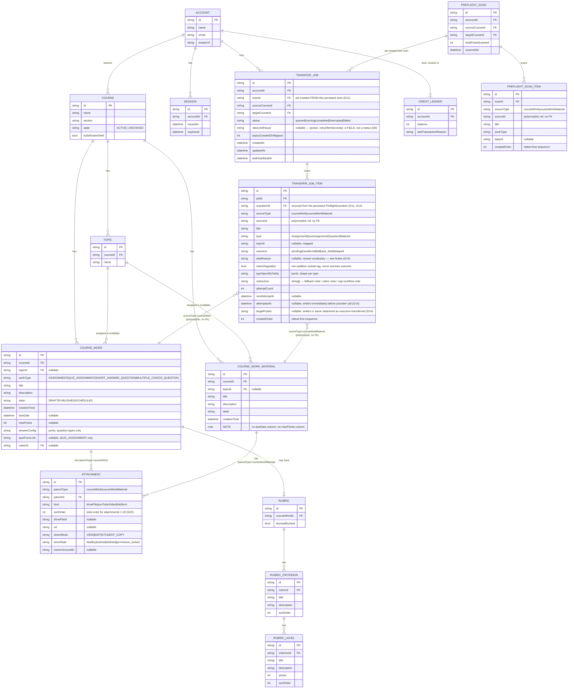

# Data model (ER) — Classroom Copier (architecture theme 5)

Two structurally separate tables for `CourseWork` and `CourseWorkMaterial`
(per-type fidelity — see 04-architecture.md §5/§7 ADR) — no generic "post"
table.

## Notes
- `outcome` is a **single-valued, NOT NULL** enum (`pending` only until the
  engine resolves it) — this is what makes the reconciliation formula
  `(transferred) + (fallback_shell) + (skipped) = total items` a schema-level
  guarantee rather than a documentation claim. See §5/§7 ("Reconciliation-by-
  construction").
- `rubricDegraded` never touches `outcome` — it is a strictly orthogonal
  boolean, which is what makes "non-additive subset tag" true by
  construction.
- `TRANSFER_JOB_ITEM` rows are inserted as `pending` **before** any provider
  call is attempted (D2), so `total posts scanned = count(items)` by
  definition — a crash mid-transfer cannot produce a missing row, only a
  stuck `pending` one (resolved by the boot-time reconciliation pass, D1).
- `COURSE_WORK` and `COURSE_WORK_MATERIAL` share no table — a Material row
  physically cannot carry a `dueDate` or `maxPoints` value because those
  columns do not exist on it.
- **The pre-flight scan is persisted** (D11): `PREFLIGHT_SCAN` +
  `PREFLIGHT_SCAN_ITEM` (one row per enumerated post, in `post-enumerator`'s
  total order) so `totalPostsScanned` is `count(PreflightScanItem)` — one
  measurement, read twice. `POST /transfer-jobs` inserts `TRANSFER_JOB_ITEM`
  rows **from these stored rows**, never a fresh re-enumeration, which is why
  `TRANSFER_JOB_ITEM.scanItemId` references a `PREFLIGHT_SCAN_ITEM` and a
  `TRANSFER_JOB` is created FROM a `PREFLIGHT_SCAN`.
- **`TransferJob.status` is a clean lifecycle enum** —
  `queued | running | completed | interrupted | failed`. Rate-limit pause is
  a **nullable `rateLimitPause` field**, not a status (D5): the non-terminal
  predicate the unique index and `/active` both derive from is a single
  definition, `status NOT IN ('completed','interrupted','failed')`.
- `TRANSFER_JOB_ITEM.skipReason` is a closed vocabulary, split by who caused
  it: **user skips** — `user_skip_post`, `user_skip_attachment`; **system
  skips** — `provider_error`, `server_interrupted`, `rate_limit_exhausted`.
  The API exposes `skippedByUser` and `skippedBySystem` as separate counts;
  only the labelling splits — the reconciliation sum stays three-term over
  `skipped_total` (D14).
- `RUBRIC_CRITERION` and `RUBRIC_LEVEL` exist so rubric criteria/levels copy
  **verbatim** rather than being flattened into a note (D23) — `getRubric`
  then `createRubric` is the real API's get-then-create shape.
