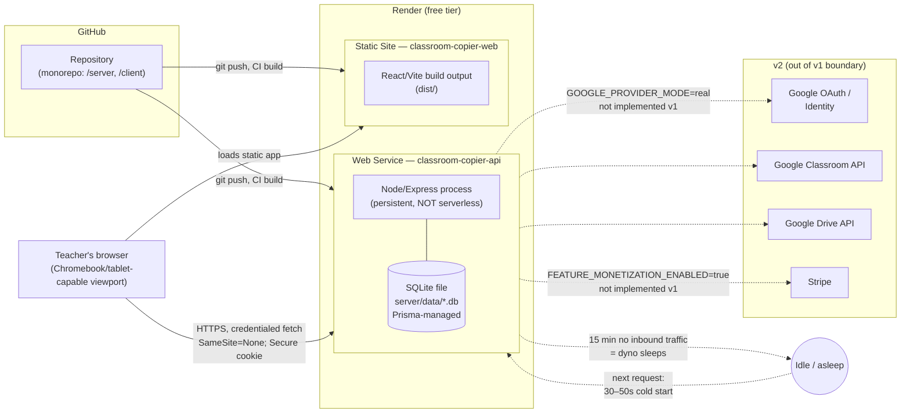

# Deployment diagram — Classroom Copier (architecture theme 9)

## Notes
- Two independently-deployed Render services, per the source PRD's
  deployment guide (carried forward as architect-stage input, not
  re-litigated) — a persistent Express web service (never serverless, to
  avoid ~10s timeouts on a 50-post/~2min transfer) and a static frontend
  site.
- Split-origin (`classroom-copier-web` calling `classroom-copier-api` cross-
  origin) requires explicit `SameSite=None; Secure` session cookies and a
  pinned CORS origin allowlist (never `*` with credentials) — see §7 ADR
  "Frontend stack" and §8 Cross-cutting concerns (Auth/security).
- Cold start (30–50s wake) only realistically hits the **API** service, and
  only at a session's first action or after >15 minutes of true inbound
  idle — during an active transfer job, the client's ~1.5s status-poll
  traffic itself keeps the dyno from sleeping. The static site has no
  server process and does not sleep.
- Migrations (`prisma migrate deploy`) and idempotent fixture reseeding run
  as part of the API service's boot sequence, so a wiped/fresh disk on
  redeploy self-heals to a known-good F1–F13 state (mitigation for Delta
  D3 — SQLite-on-redeploy persistence is unverified, see
  04-architecture.md Deltas).
