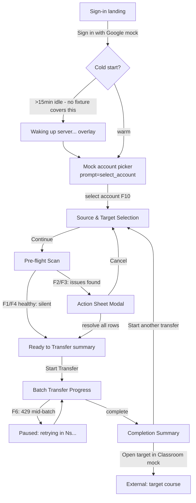

# Flow — Classroom Copier (low-fi)

Low-fidelity process flow. Structure only — no visual style (that's the UI stage).

## Notes
- Steps A–I are the linear 5-step workflow (Sign in → Select → Pre-flight →
  Transfer → Summary) from the PM brief, expanded into concrete surfaces.
- The account picker (C) is forced every fresh sign-in (`prompt=select_account`
  semantics) — not skippable, not just shown once per browser.
- Pre-flight (E) is silent by default (F1/F4) and only surfaces the Action
  Sheet Modal (G) when F2/F3-type issues are detected.
- "Ready to Transfer" (F) is a deliberate added confirmation checkpoint before
  the irreversible-ish batch-write step — see Decisions in 02-ux-workflow.md.
- **Cold-start transition (B → B1) has no fixture.** Unlike the `F1`–`F11`
  tags elsewhere in this diagram, which cite real seeded fixtures from the
  brief's manifest, the cold-start transition is fixture-uncovered — QC
  cannot certify it against a seeded fixture, only against manual/local
  Render-free-tier testing. It also depends on an architecture-level
  decision (client-clock-based vs. server-signaled idle detection) not yet
  made — see Deltas in `02-ux-workflow.md`.
